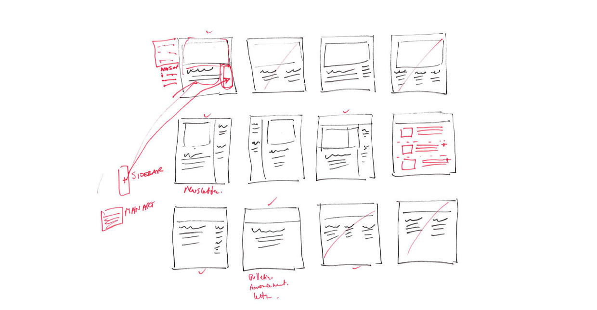

# Guerilla UX

Quick and dirty methods

for small development teams

to ship better product

### Fabian Fabian, @filtercake
### Aug 16 2014, UX Camp Hamburg

---

# About me

- Interaction Designer & UI Dev at Jimdo
- father of twins
- Co-founder of UX Camp Hamburg
- Made Github from Scratch for the Open Tech School
- filtercake.com, @filtercake

---

# Guerilla UX ???

---

# Guerilla UX ???

- waited five years for sb else to write a book or blog with that title
- closest came ["The UX Team of One" by Leah Buley](http://rosenfeldmedia.com/books/ux-team-of-one/). Awesome book, do read it!

¯\\\_(ツ)_/¯

---

# Quick and dirty: The Better-Than Approach™

## "DIY or die"

The goal:

- Find one thing and take one hour on monday to try it out

###### icon: http://thenounproject.com/term/tools/45342/

---

# Value and Creativity

---

# Value

- product value
- human value
- communication
- collaboration
- try a "value journal"

---

# Value is, wait for it, the only thing of value.

---

# Creativity

- throwing away nine ideas to get to idea number ten
- it's not "waste", it is *process*
- needs time, space and protection
- get a thick skin
- culture helps. a lot!

###### John Cleese on Creativity: https://www.youtube.com/watch?v=ixci-5EAkWA – icon: http://thenounproject.com/term/brainstorm/15232/

---

# Let's Go!

---

# talk to your users
### Jared Spool: companies whose employees spend time with users have higher revenue

- find some typical questions for user interviews on the web
- visit users in their natural habitat
- call them
- invite them to your office

###### icon: http://thenounproject.com/term/talking/48202/

---

# sketching
### always always always sketch

- sketching is not drawing
- demo: sketching is easy
- visuals always explain it better
- have a sketchbook handy
- always always always sketch

###### image: https://www.behance.net/gallery/1162469/Wireframes-UX-UI-Sketches

---

# btw: difference between sketches and wireframes

more or less:

- a wireframe gives correct proportions and content (blueprint)
- a sketch zooms, emphasizes and leaves stuff out

---

# design studio method

- rapid group iteration
- sketch, pitch, critique. repeat.
- collaboration and alignment
- hard timeboxes
- stealing is good
- the more cross the better
- quantity not quality

###### vimeo.com/37861987 – photo: http://www.letterpress.se/2014/01/design-studio-in-the-wild/

---

# sketchboard

- all the sketches on a canvas
- tell the story of why and how you got there
- tape sketches to flipchart (and add a headline)

###### photo: https://www.flickr.com/photos/33947185@N00/4468053690

---

# paper prototyping

- cheap, fast, interactive
- can also be done in a group
- can be digitized
- for internal purposes only
- be critical with usertests
- avoid UI templates
- book a short workshop

###### book: paperprototyping.com – photo: http://dustinlarimer.com/design-management-summer-camp/

---

# "dimensional planning"

Road metaphor:

- dirt road
- cobblestone 
- asphalt
- highway

###### Stefan Roock, Koen Van Exem. sources and stuff at filtercake.com/dimensional-planning/ – icon: http://thenounproject.com/term/road/4918/

---

# "design by benchmark"

### to not reinvent a wheel out of round

- take screenshots on how your competitors do it
- if you find a common pattern: just do it that way for now, re-work later
- paste screenshot flows into keynote, share the PDF

---

# decision board

### keep remembering what happened last week

- all things you cannot or don't want to decide alone
- two sides: open and decided
- remember what and why was decided
- it's like insurance: if you have, you rarely need it. but if you don't have it...
- just make one for yourself on a sheet of A4 paper

---

# ui analytics
### every click is sacred

- see what parts of the interfaced are actually used
- see userflows
- relatively easy to hack with Google Analytics (count click as page impression)

###### icon: http://thenounproject.com/term/move/60039/

---

# pairing

- paring is good, it doesn't have to be "extreme pair brogramming"
- two brains do not just add, they kinda multiply
- four eyes see more than two
- do something in a pair you use to do alone

###### photo: http://svprojectmanagement.com/keep-your-culture-positive

---

# interview the team

- make list of things you did or tried
- short one-on-one sessions
- ask them what they did and didn't like in the past
- more, less, stop, start?
- start with *one* session, see how it goes

###### icon: http://thenounproject.com/term/dialog/6070/

---

# declarative vs imperative

- imperative: build a save button
- declarative: the user wants to save her settings
- what is the goal?
- always try to stay declarative

###### icon: http://thenounproject.com/term/information/36559/

---

# prototyping with keynote

- link elements to other slides
- link invisible overlays on images to other slides
- UI kits available

###### slideshare.net/tbisaacs/keynote-kungfu-black-belt

---

# your personal feature evolution cycle
### if your process is not a circle, it is broken.

- zero-design mvp
- beta test
- 1.0
- collect data
- iterate

---

# "generic feature KPI"

- what percentage of (paying) users is actually using a feature?
- threshold for deprecation
- avoid feature bloat

###### icon: http://thenounproject.com/term/dashboard/32220/

---

# visual prototypes

- print visual drafts of ui elements on a color printer
- cut apart, tape together (collage)
- also works for paper prototypes
- find enough views to have all elements, print out, build something

---

# "atomic design"

- design elements and components, not views
- try out pattern lab: patternlab.io

###### Brad Frost bradfrostweb.com/blog/post/atomic-web-design/

---

# code is power

- a dedicated protyping tool will never teach you how the real thing is actually built
- that's fine, just be aware of it
- why would you *not* want to know how stuff is build?
- start a tutorial

###### www.codecademy.com/en/tracks/web – no need to do the whole "7 hours" at once. Just do 20 minutes and come back later. icon: http://thenounproject.com/term/lightning-bolt/31850/

---

# the end

#### Guerilla UX @ UX Camp Hamburg 2014
#### @filtercake